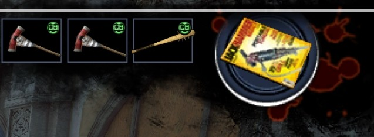

# Combo Weapon Changes

I have altered almost every single combo weapon in the game to utilize magazines. This seems like more of an oversight than anything. Or maybe Blue Castle / CV simply wanted people to spend an obnoxious amount of time finding weapon combinations. Whichever may be the case, here's the table:
 
| Weapon Name | Magazine 1 | Magazine 2 | Magazine 3 | Notes |
|-------------|------------|------------|------------|-------|
| Air Horn | Building | Amusement | - | Sum of parts[¹](#notes) |
| Auger | Building | - | - | Sum of parts |
| Beer Hat | Health 1 | Health 2 | Drinking | I mean, duh? |
| Blambow | Sports | Games | - | Archery is a sport and requires aim | 
| Blazing Aces | Sports | Games | - | Sum of parts | 
| Blitzkrieg | Domestic | Sports | - | Matches vanilla `Wheelchair` weapon[²](#notes) |
| Boomstick | Building | Sports | - | Sum of parts; shotgun used to hunt for sport |
| Burning Skull | Domestic | - | - | Some people have skull decor in their homes |
| Defiler | Building | Blades | - | Sum of parts |
| Drill Bucket | Building | Amusement | - | Sum of parts; comical in nature |
| Driller | Building | Blades | - | Sum of parts |
| Electric Chair | Domestic | Sports | - | Matches vanilla `Wheelchair` weapon | 
| Electric Rake | Domestic | - | - | Sum of parts |
| Exsanguinator | Domestic | Building | Blades | Sum of parts |
| Fire spitter | Amusement | Sports | - | Sum of parts |
| Flamethrower | Amusement | - | - | Sum of parts[³](#notes) |
| Flaming Gloves | Sports | - | - | Sum of parts |
| Fountain Lizard | Amusement | - | - | Sum of parts |
| Freedom Bear | Amusement | Domestic | Games | ONE NATION UNDER GOD, INDIVISIBLE, WITH LIBERTY AND JUSTICE FOR ALL[⁴](#notes) |
| Gem Blower | Domestic | - | - | Sum of parts |
| Hacker | Construction | Domestic | Games | Sum of parts |
| Handichipper | Domestic | Construction | Amusement | Sum of parts; comical in nature |
| Heliblade | Amusement | Blades | - | Sum of parts |
| Holy Arms | Construction | Amusement | - | Sum of parts |
| Infernal Arms | Amusement | - | - | Sum of parts |
| Knife Gloves | Blades | Sports | - | Sum of parts | 
| Laser Sword | Domestic | Games | Amusement | Sum of parts |
| Paddlesaw | Building | Blades | - | Sum of parts |
| Parablower | Domestic | Construction | - | Sum of parts |
| Plate Launcher | Domestic | Construction | - | Sum of parts |
| Pole Weapon | Blades | Domestic | - | Sum of parts |
| Porta Mower | Domestic | Construction | - | Sum of parts; comical in nature |
| Power Guitar | Amusement | Games | - | Sum of parts; comical in nature |
| Ripper - Blades | Construction | - | - | Sum of parts |
| Roaring Thunder | Amusement | - | - | Sum of parts | 
| Rocket Launcher | Amusement | Construction | - | Sum of parts |
| Snowball Cannon | Amusement | Domestic | - | Sum of parts | 
| Spear Launcher | Blades | - | - | Sum of parts |
| Spiked Bat | Sports | Construction | - | Sum of parts[⁵](#notes) |
| Super BFG | Games | - | - | DOOM reference |
| Super Slicer | Amusement | Blades | - | Sum of parts; comical in nature |
| Tenderizers | Sports | Construction | - | Sum of parts |
| Tesla Ball | Amusement | - | - | Giant electrical hamster ball of death |

---

## Photo proof of concept

> ### So far, only those items shown have been tested thoroughly. I welcome feedback on what items do or don't work from other users.

### Additional tidbits

1. Magazine choices should be somewhat obvious, based on the core components used to make the combo weapon in question.
2. Looking in the game's source, the developers put wheelchair as both a `Domestic` and `Sports` object.
	* Originally I was going to repurpose and edit an underutilized magazine to apply it specifically to wheelchair items, but having found that out on accident, I now no longer need to.
3. Nothing else quite fit here, so it only uses the `Toy` property due to the required water gun.
4. I mean, it's a Rambo bear. Come on. 'Murica.
5. Easily the most overused weapon by virtually all players. It's already durable in vanilla. I really wanted to make it three magazines to match vanilla `Baseball Bat`, but that would've been overkill, I feel, and made PP farming even easier than it already is.